# 基础知识点

类似循环语句，判断语句这些基础语法各语言都类似，不再详细说明，推荐找一本包含基础语法的书籍看一下目录，对于不太熟悉的知识点，进去详细看下。要保证在以后使用中，知道有这个语法或用法即可。
这里主要讲解下实际开发中可能会用到或者查看Abp源码或其他开源项目时不太好理解的内容。

## 1. abstract和interface
### 介绍
abstract class和interface是支持抽象类定义的两种机制，两者都是抽象类，都不能实例化。
interface强调特定功能的实现，而abstract class强调所属关系。这里主要介绍下Abstract，在Abp中有一些地方用到abstract，需要明白为什么使用Abstract。
因为平时对interface使用较多，而很少使用Abstract，其实合理使用Abstract可以提高代码复用和代码的可阅读性。-------

### 应用场景
#### interface的应用场合
------功能约定，即：继承了此接口的类，必须实现相关的功能方法。
> * 类与类之间需要特定的接口进行协调，而不在乎其如何实现。
> * 作为能够实现特定功能的标识存在，也可以是什么接口方法都没有的纯粹标识。
> * 需要将一组类视为单一的类，而调用者只通过接口来与这组类发生联系。
> * 需要实现特定的多项功能，而这些功能之间可能完全没有任何联系。

#### abstract class的应用场合
在既需要统一的接口，又需要实例变量或缺省的方法的情况下。Abp中，部分以Base后缀的需要具体实现的类，如AbpController，AbpRepositoryBase均为抽象类。
> * 某些场合下，只靠纯粹的接口不能满足类与类之间的协调，还必需类中表示状态的变量来区别不同的关系。abstract的中介作用可以很好地满足这一点。
> * 规范了一组相互协调的方法，其中一些方法是共同的，与状态无关的，可以共享的，无需子类分别实现；而另一些方法却需要各个子类根据自己特定的状态来实现特定的功能。

以AbpRepositoryBase 为例，该类大约有40多个方法，但实际参与数据库操作的只有五个方法，其他方法是对查询到的数据进行操作。

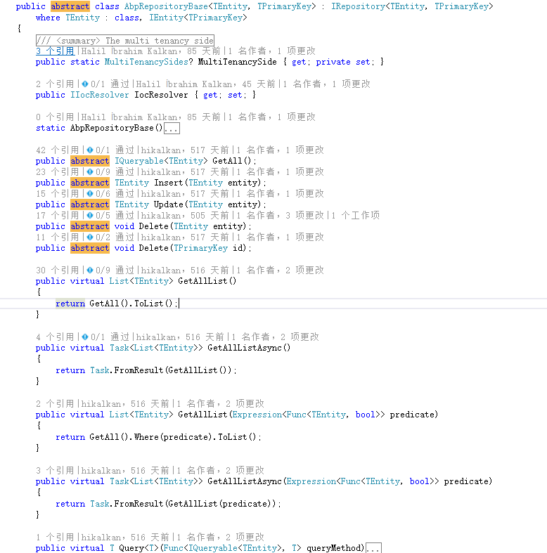

该类为基类类，其子类针对不同的ORM框架有EfRepositoryBase、MongoDbRepositoryBase等。其中GetAll、Insert、Update、Delete方法，针对使用不同的ORM框架（EF或NHibernate）需要有不同的实现方式。
而类中其他方法，则是依托这几个方法的结果进行查询，对使用什么框架没影响。所以在子类中，只需重新实现这五个方法，而其他方法无需变动。这种情况下需要使用Abstract 修饰符。
具体为什么仓储类里与数据库交互的查询方法只有GetAll,而其他条件查询是对GetAll的数据操作；这样为什么不会降低性能？EF章节单独解释。

### 相关参考
http://blog.csdn.net/xcbeyond/article/details/7667733

https://msdn.microsoft.com/zh-cn/library/sf985hc5

《C# 高级编程（第九版）》 4.3.2章节 和4.5章节

## 2.  virtual和new
### 介绍
virtual 关键字用于修饰方法、属性、索引器或事件声明，这里主要说下针对方法的区别。virtual关键字表示方法可被子类覆盖。但是即使不使用virtual，子类中编写一个同名方法（返回值和参数一致）也是可以覆盖基类方法的。

两者的区别：

不使用virtual和override，直接在子类中重写方法，C#将默认其为使用new关键字隐藏基类方法。

使用new 关键字表示隐藏基类同名方法。
~~~ C#
class Base{
    public void ShowMessage()
    {
        Console.WriteLine ("Base.show");
    }
}

class Class1:Base{
    public new void ShowMessage()
    {
        Console.WriteLine ("class1.show");
    }
}
~~~
使用virtual和override 关键字来表示覆盖父类的同名方法。
~~~ C#
class Base{
    public virtual void ShowMessage()
    {
        Console.WriteLine ("Base.show");
    }
}
class Class2:Base{
    public override void ShowMessage()
    {
        Console.WriteLine ("class2.show");
        //base.SHowMessage();  // Base.show
    }
}
~~~
两者区别在于调用时：
~~~ C#
Base c = new Class1();
c.ShowMessage();//输出： Base.show
c = new Class2();
c.ShowMessage();//输出： class2.show
~~~
Base为声明类，而Class1和Class2为实例类，在执行c.ShowMessage();时，会
> 1. 先查看声明类（Base）中此方法是否为虚方法。
> 2. 如果不是虚方法，直接执行声明类（Base）中此方法。
> 3. 如果是虚方法，查找实例类（Class1或Class2）中是否有override此同名方法，如果有，执行实例类中同名方法。
> 4. 如果没有，执行声明类同名方法。

所以当直接使用子类Class1作为声明类时，会调用子类自己的方法。
~~~~ C#
Class1 c = new Class1();
c.ShowMessage();//输出： class1.show
~~~~
### 应用场景
用于可能需要覆盖的方法，ABP中以Base后缀的类中方法基本都是virtual。

## 3. internal
添加了Internal修饰符的类，只能在包含它的程序集中访问该项。在abp框架源码中经常使用，实际使用abp做开发时使用不多。
如果需要在其他程序集使用该程序集中internal的方法或类（如测试工程），可以在被引用项目的AssemblyInfo.cs文件添加InternalsVisibleTo属性（后面 项目结构 章节有介绍）。

## 4. Assembly
程序集，定义在System.Reflection命名空间下，多用来加载和执行程序集。
程序集的理解，可以简单的认为每个项目就是一个程序集。
### Abp中使用
在Abp中,多用于模块加载，常用方法：Load、GetExecutingAssembly。
每个模块中的Initialize方法都有这一句，用来加载当前程序集。
~~~ C#
public override void Initialize()
{
    IocManager.RegisterAssemblyByConvention(Assembly.GetExecutingAssembly());
}
~~~
### 相关参考
https://msdn.microsoft.com/zh-cn/library/system.reflection.assembly(v=vs.110).aspx?cs-save-lang=1&cs-lang=csharp#code-snippet-1

《C# 高级编程（第九版）》 15.3.3章节
## 5. C#、ASP.NET和.Net Framework 关系
C#是一门开发语言，是由C及C++演变而来的，Net FrameWork类似于Java 的JVM(虚拟机)，其核心是运行库的执行环境。C#、VB等编写的代码必须在.Net Framework上运行。
ASP.NET是.NET Framework的一部分，是一种使嵌入网页中的脚本可由因特网服务器执行的服务器端脚本技术。
## 6. 装箱和拆箱
值类型存储在栈上，引用类型存储在堆上。从值类型转换为引用类型称为装箱，从引用类型转换为值类型称为拆箱。拆箱时，需要使用类型强制转换。
C#所有值类型隐式派生自System.ValueType。数组和string均为引用类型。
~~~~ C#
var list = new ArrayList();
list.Add(10);//装箱，将值类型转换为引用类型。
int i=(int) list[0];//拆箱，将引用类型转换为值类型。使用强制类型转换。
~~~~

###应用场景
> * 调用参数为Object的方法时。
> * 非泛型的容器，为了保证通用，而将元素类型定义为Object。

###性能
装箱和拆箱使用简单，但是对性能损耗较大，尤其是在遍历许多项时。
所以应尽量避免使用装箱和拆箱，可以使用重载和泛型来避免不必要的装箱和拆箱操作。
###参考
http://www.cnblogs.com/huashanlin/archive/2007/05/16/749359.html

## 7. 泛型
泛型可用于类、接口、方法和委托。使用了泛型可以保证其类型安全以及可以避免集合添加元素、取出元素时候的装箱、拆箱操作。
~~~~ C#
//前面的例子可以使用泛型，这样便不存在装箱和拆箱的性能和安全问题了
List<int> list = new List<int>();
list.Add(10);
int i= list[0];
~~~~

自定义泛型类

~~~~ C#
class MyHelper
{
    public static void AddAndPrint(int i, int j)
    {
        Console.WriteLine(string.Format("The value is {0}", i.ToString() + "@" + j.ToString()));
    }
    public static void AddAndPrint(float i, float j)
    {
        Console.WriteLine(string.Format("The value is {0}", i.ToString() + "@" + j.ToString()));
    }
    public static void AddAndPrint(double i, double j)
    {
        Console.WriteLine(string.Format("The value is {0}", i.ToString() + "@" + j.ToString()));
    }
}

static void Main(string[] args)
{
    MyHelper.AddAndPrint(100, 120);
    MyHelper.AddAndPrint(100.123F, 120F);
    MyHelper.AddAndPrint(100.456D, 120.666D);
    Console.ReadKey();
}
~~~~
创建泛型类。
格式如下,泛型类型的名称可以自定义，定义好后，在类内部可以想其他类型一样使用。
~~~~
class className<T>
{
}
//如果有多个泛型类型，使用逗号隔开即可。
class className<T1,T2>
{
}
~~~~
三个AddAndPrint函数除了参数类型以外，函数体内部实现完全一样，使用泛型实现如下：
~~~~ C#
public abstract class AbpRepositoryBase<TEntity, TPrimaryKey>
{
    public static void AddAndPrint(T t1, T t2)
    {
        Console.WriteLine(string.Format("The value is {0}", t1.ToString() + "@" + t2.ToString()));
    }
}
~~~~

Abp中泛型使用很多，以AbpRepositoryBase为例，如下：
~~~~ C#
    public abstract class AbpRepositoryBase<TEntity, TPrimaryKey> : IRepository<TEntity, TPrimaryKey>
        where TEntity : class, IEntity<TPrimaryKey>
    {
        ....
        public abstract IQueryable<TEntity> GetAll();

        public virtual List<TEntity> GetAllList()
        {
            return GetAll().ToList();
        }
        public virtual TEntity Single(Expression<Func<TEntity, bool>> predicate)
        {
            return GetAll().Single(predicate);
        }
        ...
    }
~~~~
where 约束，此类限定TEntity 必须是引用类型，且继承自IEntity<TPrimaryKey>。
作为约束使用的类型必须是接口，非密封类（使用sealed 修饰符 ）和类型参数。其中常用的几种约束方式：
> * struct：类型参数必须是值类型。可以指定除 Nullable 以外的任何值类型。
> * class：类型参数必须是引用类型，适用于任何类、接口、委托或数组类型。
> * new()：类型参数必须具有无参数的公共构造函数。当与其他约束一起使用时，new() 约束必须最后指定。
> * <基类名称>：类型参数必须是指定的基类或派生自指定的基类。
> * <接口名称>：类型参数必须是指定的接口或实现指定的接口。可以指定多个接口约束。约束接口也可以是泛型的。
> * T2：形如：where T1：T2  指定类型T1派生自泛型类型T2。

### 泛型优势
> * 类型安全
> * 无需装箱和折箱
> * 无需强制类型转换
> * 代码复用性高

### 参考
https://msdn.microsoft.com/zh-cn/library/bb384067.aspx

## 8. 委托
当需要把方法传递给其他方法时，就需要用到委托。
###使用方法
1. 定义：
~~~~ C#
delegate void MyDelegate(string arg1,int arg2);
~~~~
2. 创建实例：
~~~~ C#
MyDelegate delegate1 = new MyDelegate(Method1);//此方式创建委托并绑定一个方法

MyDelegate delegate2;//创建委托
delegate2 = Method1;//绑定方法，只要返回类型和参数类型一致，可以自动转换为委托
delegate2 += Method2;//添加绑定方法，一个委托可以绑定多个方法，执行时依次执行。

public static void Method1(string arg1,int arg2)
{
    Console.WriteLine("Method1:"+arg1+"("+arg2+")");
}
public static void Method2(string arg1,int arg2)
{
    //Method2
}
~~~~
3. 使用

可以直接执行委托：
~~~~ C#
delegate1("abc",10);
~~~~
也可以作为参数传递给其他方法（该方法接收类型为该委托的参数）：
~~~~ C#
Method13(delegate2,"abc",10);//执行方法Method2,将委托实例作为参数传递

private void Method3(MyDelegate delegate,string arg1,int arg2)
{
    //...
    delegate(arg1,arg2);
}
~~~~
委托可以同时绑定多个实例。
###使用场景
方法执行的操作并不是针对数据进行，而是要对另一个方法进行操作，而且，在编译阶段无法得知第二个方法时什么，只有在运行时才能
得知，这是需要把第二个方法作为参数传递个第一个方法，这就使用到了委托。如下几个常用委托的场景：
> * 启动线程和任务
> * 通用库类
> * 事件

###参考
http://www.tracefact.net/CSharp-Programming/Delegates-and-Events-in-CSharp.aspx

## 9. 事件
事件基于委托，为委托提供了一种发布/订阅机制。是类在发生其关注的事情时用来提供通知的一种方式。
###使用方法
1. 声明一个委托：
~~~~ C#
public delegate void PublishEventHander();
~~~~
2. 在委托的机制下我们建立以个出版事件：
~~~~ C#
 public event PublishEventHander OnPublish;
~~~~
3. 触发：
事件必须要在方法里去触发：
~~~~ C#
 public void issue()
{
    //如果有人注册了这个事件，也就是这个事件不是空
    if (OnPublish != null)
    {
        Console.WriteLine("触发事件");
        OnPublish();
    }
}
~~~~
4. 订阅：

~~~~ C#
Publisher publisher = new Publisher();

//为事件注册订阅者
publisher.OnPublish += new Publisher.PublishEventHander(Receive);
//另一种事件注册方式
//publisher.OnPublish += Receive;
//发布者在这里触发事件
publisher.issue();
~~~~
订阅者的相关事件
~~~~
public static void Receive()
{
    Console.WriteLine("我是XXX,我已经接到通知");
}
~~~~
###参考
http://www.cnblogs.com/wudiwushen/archive/2010/04/20/1703763.html
## 10. 扩展方法
扩展方法使您能够向现有类型“添加”方法，而无需创建新的派生类型、重新编译或以其他方式修改原始类型。
例如，现有Product类，其中有属性Price表示价格（int）；

需求：求一个Product集合（IList或IQueryable类型）的价格总和。IQueryable或IList中不可能有这个方法，因为无法确定集合元素类型，以及对哪个属性求和。
但是可以使用扩展方法。

###自定义扩展方法
扩展方法必须在静态类中定义，其格式为：
~~~~
public static [返回类型] [方法名](this [扩展的类型] 对象，[其他参数])
{
    ...
}
~~~~

按照上面的需求，对Queryable扩展PriceSum方法。
~~~
public static class ExtensionQueryable
{
    //这里求和，无需其他参数
    public static int PriceSum(this IQueryable<Product> source)
    {
        int _sum=0;
        foreach(Product p in source)
            _sum+=p.Price;
        return _sum;
    }
}
~~~
只要在静态类中按正确格式定义了扩展方法，无需其他配置，using引用了命名空间即可使用扩展方法，以后对Queryable<Product>类型集合求价格总和可以直接使用PriceSum方法：
~~~~ C#
int sum=products.PriceSum();
~~~~
不过这个扩展方法只对IQueryable<Product>类型有效，复用性不高，C#已经提供了复用性更高的扩展方法。

在System.Linq 命名空间下有对Queryable的相关扩展方法
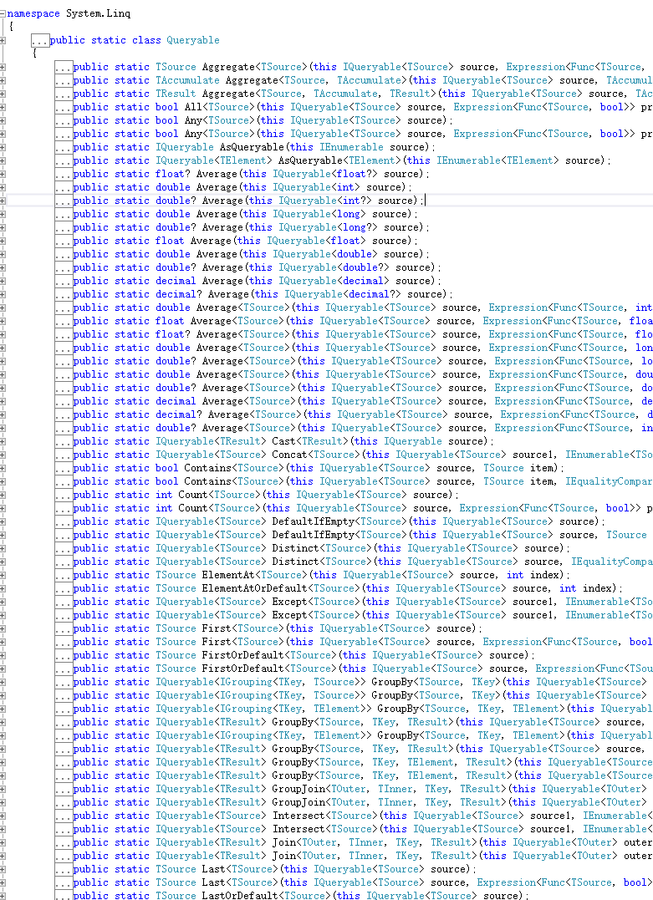
针对价格求和的需求也提供了相应的泛型扩展方法
~~~~ C#
public static int Sum<TSource>(this IQueryable<TSource> source, Expression<Func<TSource, int>> selector);
~~~~
不过需要配合Lambda表达式使用。

## 11. Lambda表达式
lambda表达式在很多地方都有使用，如Linq查询，事件、委托。匿名函数等等。
### lambda运算符 =>
运算符(=>)将表达式分为两部分，左边指定输入参数，右边是lambda的主体。
### 写法
一个参数：param=>expr

多个参数：(param1,param2)=>expr

没有参数：()=>expr

Lambda表达式可以用于类型为委托的任意地方，类型是Expression或Expression<T>时，也可以使用Lambda表达式，此时编译器会创建一个表达式树。
### 用于委托类型
~~~~ C#
//求平方的Lambda表达式，将表达式分配给委托类型
delegate int MySquare(int i);
delegate int MySum(int i,int j);
...
MySquare mySquare = x => x * x;
MySum mySum=(x,y)=>x+y;

int j = mySquare(5); //j = 25
int sum = mySum(10,25);//35
~~~~

### 用于Expression<T>
在使用Linq中，扩展方法需要将一个委托类型作为参数，这样就可以使用Lambda表达式赋予参数。Expression<T> 中T为委托类型。
例如：
~~~~ C#
IQueryable<Product> products = myEntities.Product;
var list=products.Where(a => a.price > 100);
~~~~
先看Where中的参数，是Lambda表达式，根据Lambda表达式的结构，a为参数，表达式为 a.price>100  ，也就是返回一个bool类型值。
Where方法为Queryable类的扩展方法，F12查看定义可知，Where方法有很多重载，针对本例，其定义如下：
~~~~C#
public static IQueryable<TSource> Where<TSource>(this IQueryable<TSource> source, Expression<Func<TSource, bool>> predicate);
~~~~
Where方法接收一个Expression<Func<TSource, bool>>类型的参数。继续F12查看Func的定义，
~~~~ C#
namespace System
{
    public delegate TResult Func<in T, out TResult>(T arg);
}
~~~~
可知是System命名空间下定义的一个泛型委托类型。该委托类型接收T类型的参数，返回TResult类型的返回值。
这里的参数类型T对应Where方法中的Tsource，而返回类型为bool。
~~~~ C#
var list=products.Where(a => a.price > 100);
~~~~
这里的a=>a.price>100 为Lambda表达式，首先表达式赋予Func<Product, bool>类型的委托，然后编译器将其编译为Expression<Func<Product, bool>>类型的表达式树。
上一章节的价格求和的实现也可以使用Queryable的扩展方法实现：
~~~~ C#
int sum= products.sum(p=>p.Price);
~~~~

## 12. LINQ
语言集成查询（Language Integrated Query ，Linq ）在C#编程语言中集成了查询语法，可以用相同的语法访问不同的数据源。
~~~~ C#
var users = from u in db.user
                     where u.Id > 10
                     orderby u.Id descending  //倒序
                     select u;

// var users = db.user.OrderByDescending(p => p.Id).Where(p => p.Id > 10);
~~~~

###参考
http://www.cnblogs.com/knowledgesea/p/3897665.html  （十种LINQ的常用查询方法）

https://code.msdn.microsoft.com/101-LINQ-Samples-3fb9811b/view/SamplePack#content   （MSDN上的Linq的比较全的例子）

《C#高级编程（第九版）》 第11章 （详细讲解）

## 13. 异步编程
使用异步编程，方法调用是在后台运行（通常在线程或任务的协助下），并不会阻塞调用线程。
### 3种模式
> * 异步模式
> * 基于事件的异步模式
> * 基于任务的异步模式

主要介绍第三种基于任务的异步模式。
一般情况下，该模式定义一个带有“Async” 后缀的方法，并且返回一个Task类型。
方法声明的返回值类型为Task<T> ，但并不需要声明一个Task<T>类型的变量作为返回结果。只需要声明一个T类型的变量，并使用await关键字即可。

如，Abp中AbpRepositoryBase类中的GetAsync方法：
~~~~ C#
public virtual async Task<TEntity> GetAsync(TPrimaryKey id)
{
    var entity = await FirstOrDefaultAsync(id);
    if (entity == null)
    {
        throw new AbpException("There is no such an entity with given primary key. Entity type: " + typeof(TEntity).FullName + ", primary key: " + id);
    }
    return entity;
}
~~~~
### async 和await
使用 async 修饰符可将方法、lambda 表达式或匿名方法指定为异步。
如果 async 关键字修饰的方法不包含 await 表达式或语句，则该方法将同步执行。

###使用
Abp中AbpRepositoryBase类

###参考
https://msdn.microsoft.com/zh-cn/library/hh191443.aspx

https://msdn.microsoft.com/zh-cn/library/hh156513.aspx

《C#高级编程（第9版）》 第13章 异步编程

## 14. HttpApplication
在HttpApplication中，利用.Net中的事件机制，通过在处理过程中依次发出的多个事件，将这个处理过程分解为多个步骤，这个处理机制通常我们称为处理管道。
HttpApplication处理管道示意图：
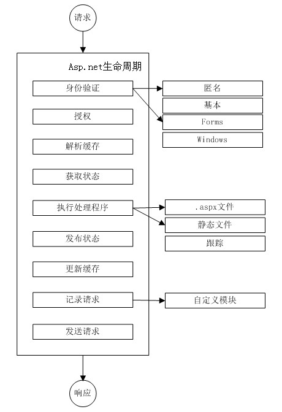

###参考
http://www.cnblogs.com/kissdodog/p/3527922.html

## 15. 项目结构

创建项目的同时会创建一个解决方案，之后可以在此解决方案上添加新项目。

###项目类型
如图，新建项目中列出了使用C#开发，常用的一些项目类型，而如果是开发Web项目，常用的项目类型为图中圈出的四种：
> * ASP.NET Web Application(.NET Framework)
> * 类库
> * ASP.NET Core Web Application(.NET Core)
> * ASP.NET Core Web Application(.NET Framework)
> * Class Library(.NET Core)

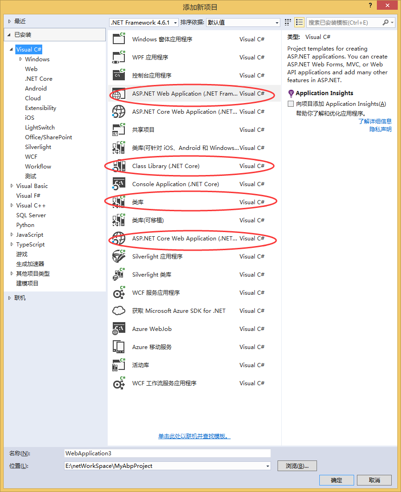

后三个后面再介绍，先看前两个项目的项目结构
### 项目结构
类库项目和Web App项目都会有Properties、引用 以及项目自身的文件，部分需要配置信息的项目会有app.config或者web.config文件。
Web 应用程序会有Global.asax和StartUp.cs文件作为启动入口和相关配置；使用NuGet的话，会有packages.config文件来管理NuGet程序包。
具体各类型项目之间的不同下一章介绍。

Properties下有AssemblyInfo.cs文件。此文件下包含了该程序集的相关信息，如果此项目下部分内部类需要被其他项目使用，可在此文件设置InternalsVisibleTo 属性。
Abp中Abp项目下的AssemblyInfo.cs文件配置如下：
~~~~ C#
[assembly: AssemblyTitle("ASP.NET Boilerplate")]
[assembly: AssemblyDescription("ASP.NET Boilerplate")]
[assembly: AssemblyConfiguration("")]
[assembly: AssemblyCompany("Volosoft")]
[assembly: AssemblyProduct("Abp")]
[assembly: AssemblyCopyright("Copyright © 2016")]
[assembly: AssemblyTrademark("")]
[assembly: AssemblyCulture("")]

[assembly: InternalsVisibleTo("Abp.Application")]
[assembly: InternalsVisibleTo("Abp.EntityFramework")]
[assembly: InternalsVisibleTo("Abp.EntityFrameworkCore")]
[assembly: InternalsVisibleTo("Abp.NHibernate")]
[assembly: InternalsVisibleTo("Abp.Web.Common")]
[assembly: InternalsVisibleTo("Abp.AspNetCore")]
[assembly: InternalsVisibleTo("Abp.Web")]
[assembly: InternalsVisibleTo("Abp.Web.Api")]
[assembly: InternalsVisibleTo("Abp.Web.Mvc")]
[assembly: InternalsVisibleTo("Abp.Web.Resources")]

[assembly: InternalsVisibleTo("Abp.Tests")]
[assembly: InternalsVisibleTo("Abp.EntityFramework.Tests")]
[assembly: InternalsVisibleTo("Abp.RedisCache.Tests")]
[assembly: InternalsVisibleTo("Abp.Web.Tests")]
[assembly: InternalsVisibleTo("Abp.Web.Api.Tests")]

// Setting ComVisible to false makes the types in this assembly not visible
// to COM components.  If you need to access a type in this assembly from
// COM, set the ComVisible attribute to true on that type.
[assembly: ComVisible(false)]

// The following GUID is for the ID of the typelib if this project is exposed to COM
[assembly: Guid("7b50eb47-4993-4a14-b65c-b61714a607b9")]
~~~~
其中设置InternalsVisibleTo属性的部分，即表示该程序集内部类（internal修饰）对其指定的项目开放使用。

而 ASP.NET Web Application 项目除了以上内容外，还包括了如下图所示的内容，包括一些静态文件、css、js以及Controller、Model和View模板等内容。App_Start还有一些路由、Bundle的配置信息。

## 16. EF
### DbContext、DbSet
定义了从实体对象到数据库的映射。官方解释：DbContext 实例表示工作单元和存储库模式的组合，可用来查询数据库并将更改组合在一起，这些更改**稍后**将作为一个单元写回存储区中。

我们只需知道是用来通过实体对象查询和操作数据库就足够。
在使用Abp框架时，会创建一个类（一般会以DbContext为后缀）直接或间接继承自AbpDbContext。
而在Abp框架中，AbpDbContext继承自DbContext,而且对AbpDbContext又进行了多次封装，最终在使用Abp框架时，只需要了解类EfRepositoryBase中常用的方法即可正常使用EF。

DbSet 表示上下文中给定类型的所有实体的集合或可从数据库中查询的给定类型的所有实体的集合。DbContext对哪些实体对象和数据库进行映射，需要通过DbSet指定。

在实际项目中会有一个类直接或间接继承自DbContext，每个项目中定义的实体，都需要在这个类中显示的声明。如下：
~~~~ C#
public class MyAbpProjectDbContext : AbpZeroDbContext<Tenant, Role, User>
{
    //TODO: Define an IDbSet for your Entities...
    public virtual IDbSet<Order> Orders { set; get; }

    /* NOTE:
     *   Setting "Default" to base class helps us when working migration commands on Package Manager Console.
     *   But it may cause problems when working Migrate.exe of EF. If you will apply migrations on command line, do not
     *   pass connection string name to base classes. ABP works either way.
     */
    public MyAbpProjectDbContext()
        : base("Default")
    {

    }
    ...
}
~~~~
### 使用
基本的查询
~~~~ C#
using (var context = new BloggingContext())
{
    var blogs = context.Blogs.ToList();
    var blog = context.Blogs.Single(b => b.BlogId == 1);
    var blogs2 = context.Blogs
            .Where(b => b.Url.Contains("dotnet"))
            .ToList();//Tolist 为立即加载，如果不使用TOlist将会延迟加载。
}
~~~~

增、删、改。修改数据库的操作，最后需要调用SaveChanges()方法来执行修改。
~~~~ C#
//新增记录
using (var db = new BloggingContext())
{
    var blog = new Blog { Url = "http://sample.com" };
    db.Blogs.Add(blog);
    db.SaveChanges();
}
//修改记录
using (var db = new BloggingContext())
{
    var blog = db.Blogs.First();
    blog.Url = "http://sample.com/blog";
    db.SaveChanges();
}
//删除记录
using (var db = new BloggingContext())
{
    var blog = db.Blogs.First();
    db.Blogs.Remove(blog);
    db.SaveChanges();
}
~~~~

EfRepositoryBase类中方法如下：
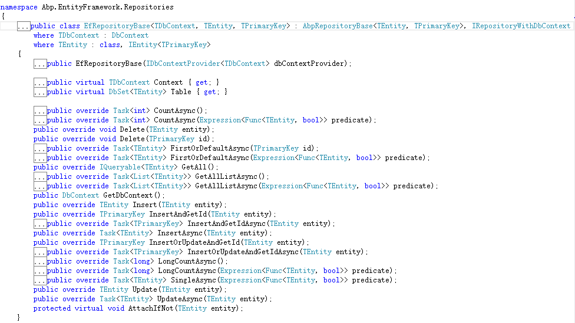
其他相关操作可参加官方文档。

这里的EF的官方概念的“稍后”就解释了第1章节的AbpRepositoryBase 里面的疑问：为什么仓储类里与数据库交互的查询方法只有GetAll,而其他条件查询是对GetAll的数据操作；这样为什么不会降低性能？

因为EF是支持延时加载的，所以在查询数据是可以直接使用GetAll，然后在数据使用之前进行其他条件筛选。最后真正执行查询时，会对查询条件进行合并。当然，这是仓储基类的优化方案，在实际项目编码时，直接使用仓储类的相关方法，应避免这种先GetAll在条件查询的方式。

#### 参考
https://docs.efproject.net/en/latest/  官方文档

https://code.msdn.microsoft.com/101-LINQ-Samples-3fb9811b/viewsamplepack  Linq

## 17. IQueryable, IEnumerable, IList
三个集合接口，常用在EF查询中。

> * IQueryable和IEnumerable都是延时执行的，而IList是即时执行。
> * IQueryable和IEnumerable在每次执行时都必须连接数据库读取，而IList读取一次后，以后各次都不需连接数据库。
> * IQueryable在可以将多个查询条件组合。

~~~~C#
//IQueryable
IQueryable<Product> expression = ctx.Products.Take(5);
IQueryable<Product> products = expression.Take(2); // A  不执行SQL
Console.WriteLine(products.Count());　　　　　　　 // B　SELECT COUNT(1) FROM ( SELECT TOP (2) * FROM ( SELECT TOP (5) * FROM [dbo].[Products] ))
Console.WriteLine(products.Count());　　　　　　　 // C  SELECT COUNT(1) FROM ( SELECT TOP (2) * FROM ( SELECT TOP (5) * FROM [dbo].[Products] ))
foreach (Product p in products)　　　　　　　　　　// D  SELECT TOP (2) * FROM ( SELECT TOP (5) * FROM [dbo].[Products]
{
    Console.WriteLine(p.ProductName);
}
foreach (Product p in products)　　　　　　　　　　// E  SELECT TOP (2) * FROM ( SELECT TOP (5) * FROM [dbo].[Products] )
{
    Console.WriteLine(p.ProductName);
}

//IEnumerable
IEnumerable<Product> expression = ctx.Products.Take(5).AsEnumerable();
IEnumerable<Product> products = expression.Take(2);  // A  不执行SQL
Console.WriteLine(products.Count());　　　　　　　　　　// B　SELECT TOP (5) * FROM [dbo].[Products]

//IList
IList<Product> products = expression.Take(2).ToList(); // A  SELECT TOP (2) * FROM ( SELECT TOP (5) * FROM [dbo].[Products]
Console.WriteLine(products.Count());                    //不执行sql
~~~~
### 参考
http://blog.csdn.net/codefighting/article/details/20324205

## 18. NuGet
类似于NodeJs中的npm。
### NuGet程序包管理
可以在项目或者解决方案上右键选择管理NuGet程序包即可进入可视化管理界面。
在菜单栏--工具--NuGet包管理器---程序包管理控制台，可进入包管理控制台，也可在此通过命令行的形式管理程序包，或其他一些操作（Migration经常用到）。
###程序包源配置
在菜单栏--工具--NuGet包管理器---程序包管理设置。选择程序包源选项，可添加程序包源。

## 19. ASP.NET Core 1.0
之前都学习过NodeJs，所以新版本的Asp.Net Core很好理解。
ASP.NET Core 1.0由ASP.NET 5 改名而来，同时名称变动的有：
> * ASP.NET 5 –> ASP.NET Core 1.0
> * .NET  5 –> .NET Core 1.0
> * Entity Framework 7 –> Entity Framework Core 1.0

这里先只对ASP.NET Core 1.0 做简单介绍。
ASP.NET Core是对ASP.NET的重新设计，其主要特色是跨平台。
ASP.NET Core开发的应用程序可以在.NET Core或者.NET Framework上运行。
再来看之前的项目类型。

其中ASP.NET Core Web Application(.NET Core) 、ASP.NET Core Web Application(.NET Framework)为ASP.NET Core 应用程序在两个不同平台的支持。
和其他两个传统项目主要区别在于完全以NuGet作为依赖引用方式，主要体现在项目中新增了project.json文件，该文件用来管理NuGet引用，包括基础的运行库都可以通过Nuget指定。
ASP.NET Core 优势：
> * 统一了WebUI和Web APIs的创建流程。
> * 整合了现代客户端框架和开发工作流程。
> * 云就绪基础环境的配置系统。
> * 可以将程序寄宿在IIS或自托管服务上。（原文：Ability to host on IIS or self-host in your own process）
> * 全面支持NuGet。(Ships entirely as NuGet packages)
> * 简化了现代Web开发。
> * 可以构建和运行在Windows，Mac和Linux的跨平台的ASP.NET应用。
> * 开源和社区化。

###项目结构
ASP.NET Core 项目或  基于.NET Core 的项目其项目结构略有变化。
> * 使用project.json 来配置项目，包括项目版本，运行平台（.NET Framework 或 .NET Core ）和NuGet程序包管理（弃用了project.js
on）。
> * Web应用程序更为简洁。
> * web应用程序启动入口变为Program的控制台程序。
> * bundle信息改由 bundleconfig.json管理。

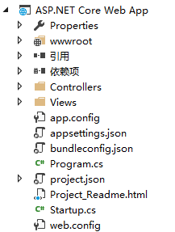
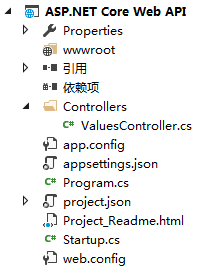
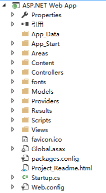

###统一了WebUI和Web APIs的创建流程。

上面两张图分别是
ASP.NET Core Web App和ASP.NET Core Web API的项目结构图，可以发现，除了一些css、js之类的Content和View模板之外，其他完全一样。
而传统的ASP.NET Application 中实现WebAPI除了Web app的相关配置之外，还需要专门配置API路由信息、认证方式以及其他相关配置。也就是Web API的部分是需要单独处理的。
### 云就绪基础环境的配置系统。
ASP.NET Core的配置系统已经对以前依赖于System.Configuration和XML配置文件web.config版本的ASP.NET进行了重新设计。ASP.NET Core 程序中依然有web.config和app.config，
不过其内容只有极少的配置项。而大部分配置信息，使用json文件存储，更为清晰，而且配置信息都转移到了Startup文件中随着程序启动时进统一加载。

传统asp.net 程序的Startup.cs文件中仅进行了身份认证配置。

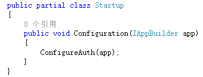

而在ASP.NET Core 程序的Startup中，除了加载相关配置之外，还可以在此配置需要的服务中间件。
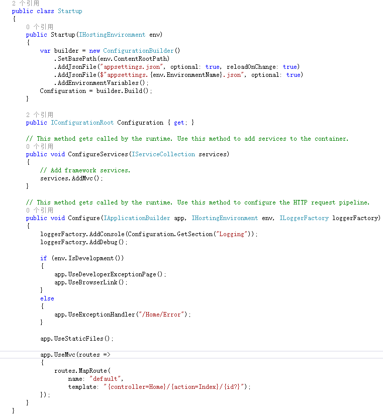

### 可以将程序寄宿在IIS或自托管服务上。
这个功能是.Net Core为跨平台做的相关改进，具体可以看下程序的启动入口。
传统ASP.Net web程序的入口是Global.asax文件中的Application_Start方法，这是HttpApplication中的一个方法，也是传统的管道处理生命周期的一部分，IIS处理请求过程中由.net framework运行时调用。这就要求程序必须运行在安装了.net Framework的IIS服务器上。

而ASP.NET Core完全中托管应用程序的Web服务器中解耦出来，ASP.NET Core支持使用IIS、IIS Express以及其他使用了Kestrel 和 WebListener HTTP servers的服务器程序。托管程序的web服务器并不会直接监听请求，而是将请求包装到HttpContext中转发给应用程序（Kestrel Server）。

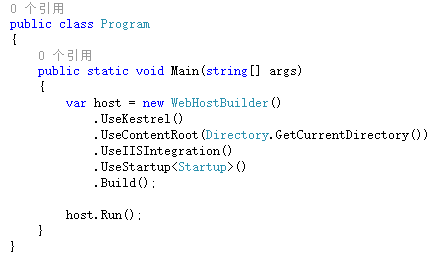

### 参考
http://www.cnblogs.com/shanyou/p/Jexus_Kestrel.html   （跨平台部署案例）

https://docs.asp.net/en/latest/intro.html

http://www.cnblogs.com/Leo_wl/p/5507534.html