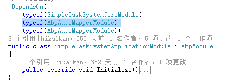
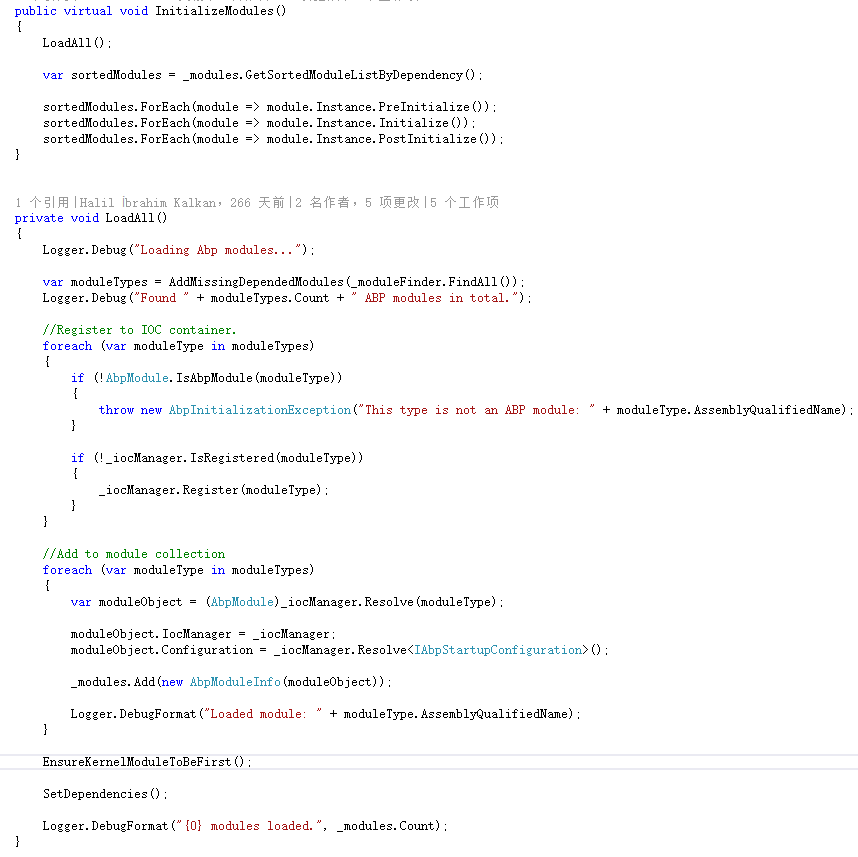

# ABP框架学习

## ABP介绍

### 参考

http://www.codeproject.com/Articles/hi_kalkan#Article    (Halil ibrahim Kalkan的文章)

http://www.cnblogs.com/1zhk/p/5268054.html  （ABP源码分析）

http://www.cnblogs.com/farb/p/ABPTheory.html  （ABP框架理论）

http://aspnetboilerplate.com/Pages/Documents  （官方文档）

## 1. 依赖注入

### 注入方式

#### 1. 使用Castle注入框架
ABP使用Castle依赖注入框架进行依赖注入，同时为了适应ABP框架，对其进行了一些封装。
基于Castle注入框架的使用，可以查看接口IWindsorContainer，大部分的Register和Resolve都在此接口中。

比如AbpBootstrapper中为核心模块的配置类进行注册时使用的Install方法：
~~~~ C#
IocManager.IocContainer.Install(new AbpCoreInstaller());
~~~~
此方法可接收一个或多个 IWindsorInstaller类型的对象作为参数，IWindsorInstaller接口只有一个Install方法，其内部实现其实是同时对多个组件进行注册。

#### 2. 使用ABP对Castle的封装类和方法
为了减少代码重复和方便使用，ABP通过对Castle的封装提供了多种方式的Register和Resolve方式。这部分可参考框架项目Abp中Dependency文件夹下的接口和类。

ABP中经常使用的IocManager.Register(...)、IocManager.RegisterIfNot(...)和IocManager.Resolve(...)等都是使用的对Castle注入框架的封装。

其中IIocRegistrar 和IIocResolver 中分别定义了一些常用的Register和Resolve方法。
例如几乎每个模块的Initialize方法中都会用的这句代码，就是在IIocRegistrar接口中的方法，其实现原理是通过Castle框架中的IWindsorContainer接口的Install方法完成。
~~~~ C#
IocManager.RegisterAssemblyByConvention(Assembly.GetExecutingAssembly()); 
~~~~

其他的类似方法可参考IocManager类。

#### 3. 自动对符合约定的组件进行注册
Abp支持自动完成符合Conventional（基于约定）的组件的注册。 Conventional 的规则要通过继承IConventionalDependencyRegistrar接口实现。
目前ABP框架中有4个类继承自IConventionalDependencyRegistrar接口，如下图：

其中BasicConventionalRegistrar设置了所有继承至ITransientDependency，ISingletonDependency和IInterceptor接口的类都会被自动注册。
其他三个则分别注册AbpDbContext，ApiController和Controller的派生类。

### 参考
https://github.com/castleproject/Windsor/tree/master/docs  （Castle Windsor官方文档）

ABP项目源码
 
## 启动配置

## AutoMapper
AutoMapper是一个对象和对象间的映射器。
### DTO
DTO的作用
> * 领域层抽象
> * 数据隐藏
> * 序列化和懒加载问题

AutoMapper就是DTO和实体的自动映射工具。

### AntoMapper使用

##### 1. Nuget添加引用
##### 2. 定义Profile配置

##### 3. 添加AutoMapperConfig配置文件

##### 4. 配置AutoMapper
AutoMapper的配置，每个应用域（AppDomain）应该只发生一次配置。那就意味着最好的配置代码的地方应该在应用启动时，例如ASP.NET应用的Global.asax。

##### 5. 使用
~~~~
var person=_personRepository.Get(Id);
PersonDto dto = Mapper.Map<PersonDto>(person);
~~~~

## Abp.AutoMapper

Abp.AutoMapper是对AutoMapper的扩展，主要为MapTo扩展方法和Attribute。

如果使用Abp.AutoMapper，由于其封装了相关的方法，并为object类添加了MapTo扩展方法，所以可以这样使用
~~~~
var person=_personRepository.Get(Id);
PersonDto dto = person.MapTo<PersonDto>();
~~~~

 
或者使用 Attribute方式，使用此方式，只需在需要的项目上引用Abp.AutoMapper，并在需要映射的类上添加Attribute，无需进行CreateMap的相关配置（1-4步骤）。

~~~~
[AutoMap(typeof(MyClass2))] //定义映射（这样有两种方式进行映射）
public class MyClass1
{
    public string TestProp { get; set; }
}

public class MyClass2
{
    public string TestProp { get; set; }
}

~~~~
Abp.AutoMapper共定义了3种Attribute，分别是：AutoMap、AutoMapTo和AutoMapFrom。AutoMap为双向映射，其他两个为单向映射。

P.S. 在使用到Abp.AutoMapper的模块中需要添加相应的依赖，否则Abp将不会加载Abp.AutoMapper模块，会导致映射失败的情况。

 
### 参考

http://www.cnblogs.com/farb/p/AutoMapperContent.html

https://github.com/AutoMapper/AutoMapper/wiki

http://www.cnblogs.com/farb/p/4973910.html

## Module加载过程

Web应用程序的启动入口Global.asax继承自AbpWebApplication，其中方法Application_Start中会调用AbpBootstrapper.Initialize();方法，而模块的加载正式从此方法的调用开始。

在Initialize方法中，会通过ModuleManager调用InitializeModules进行模块初始化。

利用IModuleFinder找到所有模块，并对模块进行初始化操作。

### 参考
http://www.cnblogs.com/1zhk/p/5281458.html

## UnitOfWork

UnitOfWork它的中文是操作单元的意思，就是将多个操作放在一个单元中，把操作原子化。

ABP以AOP的方式实现UnitOfWork功能。通过UnitOfWorkRegistrar将UnitOfWorkInterceptor在某个类被注册到IOCContainner的时候，一并添加到该类在容器中对应的ComponentModel的Interceptors集合中。
该类的Initialize方法中，对IocContainer绑定了ComponentRegistered事件，该事件会在每次有组件注册到IocContainer时执行。
ComponentRegistered方法中，对每个注册到IocContainer的类进行分析，将包含有需要以UnitOfWork执行方法的类添加UnitOfWorkInterceptor拦截器。

### 参考

https://github.com/castleproject/Windsor/blob/master/docs/container-events.md#componentregistered （container-events）

https://github.com/castleproject/Windsor/blob/master/docs/componentmodel.md  （componentmodel）

https://github.com/castleproject/Windsor/blob/master/docs/interceptors.md  （interceptors）

## Navigation
用来配置导航栏菜单项。NavigationConfiguration 中有Provider属性提供了继承自NavigationProvider抽象基类的类型列表。
在继承自NavigationProvider的类中配置相应的菜单。一般会在模块的PreInitialize方法中配置Provider，而在KernelModule中的PostInitialize方法中进行初始化菜单。

### 参考

http://aspnetboilerplate.com/Pages/Documents/Navigation

ABP官方提供的例子

## Localization
以SimpleTaskSystem为例,在SimpleTaskSystemWebModule中PreInitialize方法中，进行了语言和本地化资源的相关配置。

### Language
ILanguageProvider接口仅有一个GetLanguages方法，用来获取LanguageInfo列表。

ILanguageManager中提供了CurrentLanguage和GetLanguages用来获取当前语言和LanguageInfo列表。

整体关系图如下：

### Source

在实际开发中，接触到的有：ILocalizationManager 和 ILocalizationSource这两个接口。ILocalizationManager对象通过ILocalizationSource对象调用各种本地化相关的逻辑。

ILocalizationManager接口只有4个接口方法，分别用来获取LanguageInfo信息和ILocalizationSource信息。

ILocalizationSource 接口方法中，GetString及其重载方法为实际开发中比较常用，在Abp.Localization.Sources命名空间下还有有几个GetString的扩展重载方法。

使用时，只需通过ILocalizationManager对象获取ILocalizationSource实例，然后调用GetString方法即可。
~~~~ C#
ILocalizationSource _localizationSource = LocalizationManager.GetSource(LocalizationSourceName);
LocalizationSource.GetString(name, culture);
~~~~

### 参考

http://www.cnblogs.com/1zhk/p/5320751.html 

## Feature
### 介绍
大部分SaaS模式的应用程序都会根据不同的功能和用户等级有不同的版本。这样就可以给不同的用户提供不同的价格和功能选项。

Abp提供了Feature System，可以定义Feature，检查这个Feature针对某一用户是否可用，并且可用和其他的功能（authorization 或 navigation）整合。

###  Feature Types
主要有一下两种类型。
> *  Boolean Feature  
主要用来指定某一功能针对某一类用户是否可用。

> *  Value Feature   
例如，某一OA系统产品，有限100人使用的版本和500人使用的版本。此时不能使用Boolean类型，而需要使用Value Feature。

### 定义Features
模块可以通过提供FeatureProvider类来定义自己的Feature。

定义好Provider之后，在该模块中的PreInitialize 方法里添加如下配置即可。
~~~~C#
Configuration.Features.Providers.Add<AppFeatureProvider>();
~~~~

### Feature属性

##### 必需属性
> * Name 唯一标识（string）
> * Default value  默认值

##### 可选属性
> * Scope 范围，枚举型（Edition，Tenant，All）
> * DisplayName 本地化的对用户显示的名称
> * Description 本地化的相关描述
> * InputType  （A UI input type for the feature. This can be defined, then can be used while creating an automatic feature screen.）
> * Attribute  （An arbitrary custom dictionary of key-value pairs those can be related to the feature.）

每个Feature可以有多个子Feature，通常父Feature会被定义为Boolean类型Feature，而且只有当父Feature被设置为Enable时，其子Feature才可用。

### Feature 验证

##### 使用Attribute

只有当前租户被允许通过“ExportToExcel”的Feature时，此方法才会被执行，否则，将会自动抛出一个“AbpAuthorizationException”的异常。

Attribute使用时的注意事项：

> * 不能用在private修饰的方法上。
> * 不能用在static修饰的方法上。
> * 不能用在非注入类的方法上（必须使用依赖注入）。
> * 可以用在任何通过接口调用的public方法上（如继承自接口的Application Service）。
> * 如果方法直接通过类调用，则需要使用virtual修饰（如MVC或Web API的Controller）。
> * 如果方法是protected，则此方法应该使用virtual修饰。

##### 使用IFeatureChecker
除了使用Attribute，还可以通过注入的方式使用IFeatureChecker来手动检查Feature。Application Service、MVC和Web API的Controller会自动注入并且直接可以使用。

涉及到的检查方法主要在FeatureChecker和FeatureCheckerExtensions 两个类中。

**IsEnabled**

通过IsEnabled方法（异步方法为：IsEnabledAsync）可以检查Feature是否可用。

> P.S. IsEnabled方法只能针对Boolean Type Feature使用，否则会抛出异常。如果只是想检查Feature和抛出异常，可以直接使用CheckEnabled方法。

**GetValue**

GetValue有几个重载方法和扩展方法，可以通过tenantId获取Feature值，同时也提供了异步支持。

**Client Side**

在JavaScript中，可以使用abp.features下的方法获取Feature的值。

### 参考

http://aspnetboilerplate.com/Pages/Documents/Feature-Management

## Authorization
### 介绍
企业级应用基本都会使用授权管理。Authorization用来检查用户是否有权利去执行特定的操作。

### 定义 Permissions
对每一个需要授权的操作要定义一个单独的Permission。由于Abp模块化的特性，我们可以为不同的模块定义不同的Permissions。模块可以通过创建衍生自AuthorizationProvider 的类来定义它的Permissions。

接口IPermissionDefinitionContext 包含获取和创建Permission的方法。

同Feature类似，定义好Permission后，需要在所在模块的PreInitialize 方法里进行注册。
~~~~ C#
Configuration.Authorization.Providers.Add<MyAuthorizationProvider>();
~~~~
Authorization providers 会自动通过依赖注入进行注册。因此，authorization provider可以注入任何依赖（像是Repository）从而使用其他资源去创建权限定义。

### Permission的属性

> * Name : 系统范围内的唯一名称。
> * DisplayName：本地化的用于展现给用户的名称。
> * Description：本地化的描述
> * IsGrantedByDefault：是否对所有（登录）用户的授权，除非它是明确禁止的。
> * MultiTenancySides：一个Permission可以被用在Tenant或Host上，这个枚举类型属性用来指明Permission用在哪一个上面。
> * dependedFeature：此属性用来声明一个Feature的依赖，这样的话，只有当这个Feature满足后此Permission才会被授权。

同Feature一样，Permission也可以存在子Permission，不过这里的子Permission只是为了在界面上方便分组管理而已。

### 检查Permissions

##### 使用AbpAuthorize Attribute

AbpAuthorize Attribute 是最简单而且最常用的Permission检查方式。

AbpAuthorize 特性也检查当前用户是否登录 (使用 IAbpSession.UserId)。因此，如果我们将某个方法声明为AbpAuthorize 特性，它至少会检查用户是否登录。
~~~~ C#
public void SomeMethod(SomeMethodInput input)
{
    //A user can not execute this method if he did not login.
}
~~~~

P.S. 使用AbpAuthorize Attribute的时候需要注意一下几点：
> * 不能使用在private修饰的方法上
> * 不能使用在static修饰的方法上
> * 不能使用在非注入类的方法上（必须使用依赖注入）
> * 可以使用在通过接口调用的任何public修饰的方法（例如通过继承自接口的 Application Service）
> * 如果此方法直接被类引用调用，则此方法必须通过virtual修饰
> * protected修饰的方法需要添加virtual修饰符

常用的4种类型的Authorize Attribute
> * Abp.Authorization.AbpAuthorize  (用在application service)
> * Abp.Web.Mvc.Authorization.AbpMvcAuthorize （ MVC controller）
> * Abp.WebApi.Authorization.AbpApiAuthorize （ASP.NET Web API）
> * Abp.AspNetCore.Mvc.Authorization.AbpMvcAuthorize （ASP.NET Core）

##### 使用IPermissionChecker

### 参考

http://aspnetboilerplate.com/Pages/Documents/Authorization

https://github.com/ABPFrameWorkGroup/AbpDocument2Chinese/blob/master/Markdown/Abp/4.4ABP%E5%BA%94%E7%94%A8%E5%B1%82-%E6%9D%83%E9%99%90%E8%AE%A4%E8%AF%81.md  (中文文档)

## Settings

## EventBus

## MultiTenancy

http://aspnetboilerplate.com/Pages/Documents/Multi-Tenancy 

## Caching

## Auditing

## BackgroundJob

## Notification

## DhpStartup

## TypeFinder

## IModuleFinder

## IDhpModuleManager

## ILocalizationManager
